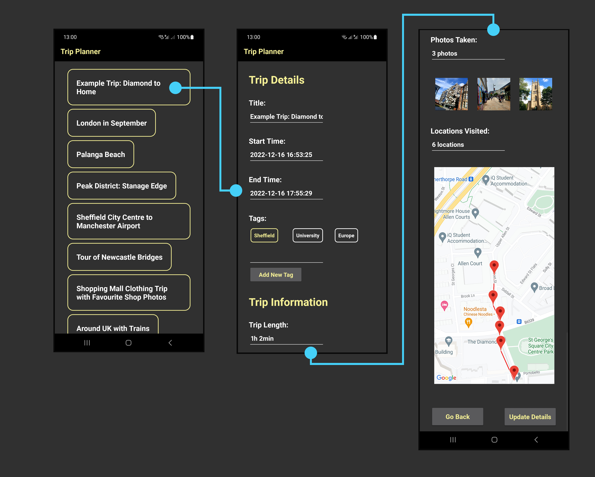

# TripPlanner

# Introduction
TripPlanner is an Android Kotlin application, which provides the user with the trip tracking
functionality. The main app features are outlined in the remainder of this section.

Utilises Google Maps API functionality.

Completed as an assessment on the COM4510 'Software Development for Mobile Devices' module at the University
of Sheffield. Achieved Group Mark: 75% (First Class).

# Installation

As per assignment requirements, the application requires > Android 11.0 (API Level 30 and above) to run.

The application should compile and install on both physical and virtual device when the root folder is
opened as a project in Android Studio or IntelliJ IDEA.

For full functionality, the device needs to have:
- GPS Sensor;
- Barometric Sensor;
- Temperature Sensor;
- Permissions for the above and Storage.

Some application functionality might not be (fully) available without the above.

# Features
## Trip Tracking
Application allows the user to create a trip including marking it with custom tags and a description.
When the trip starts, user's location is tracked every 20 seconds, together with barometric pressure
and temperature if such sensors are available. During the trip, user can take or select photos from
gallery, which are then associated with the last tracked location. The trip also tracks its start and
end times.

## Photo Gallery
Allows the user to browse through all the photos, which were taken or added during their trips. 
The gallery supports photo sorting/search on different parameters in ascending or descending order.
When a photo is selected, displays all of its properties, including location and place taken at
during the trip on the map. Further inspection allows to view original photo in full size.

## Photo Map
Allows the user to observe all photos, which were taken or added during their trips as locations
on the map. Similarly, as in the Photo Gallery, photo location selection and further photo inspection
is possible. As well as that, the user can see their current location upon request.

## Past Trips (Extra Feature)
Allows user to view a list of all past trips. Furthermore, allows trip inspection, where the trip
path is displayed on the map, together with a photo gallery of all photos taken during the trip.
Same as before, further photo details can be inspected.

# Application Structure
The application is structured using the MVVM pattern, with a single view model across the
application. This is one of the potential improvement areas for the future, as this could be split
into multiple view models.

The SQLite database is used for application data storage, which is accessed and managed through Room.

## Activity Diagram

# Copyright & Disclaimer

## Copyright
The source code of the application is licensed under the GNU General Public License 3.0, which 
can be found [here](LICENSE).

This program is distributed in the hope that it will be useful, but without any warranty; without even the 
implied warranty of merchantability or fitness for a particular purpose. See the GNU General Public License for 
more details.

## Disclaimer for Installation
**Important:** Because the application uses the Google Maps API key provided by the module,
you might get a warning when installing it. If you do, **do not click 'OK', instead expand the
dialog and select 'Install anyway (unsafe)'** as depicted in the picture bellow. However, please
be aware that the application does not provide any safety guarantees, was completed as a part of a
module assessment and **should be executed on your own risk**.

